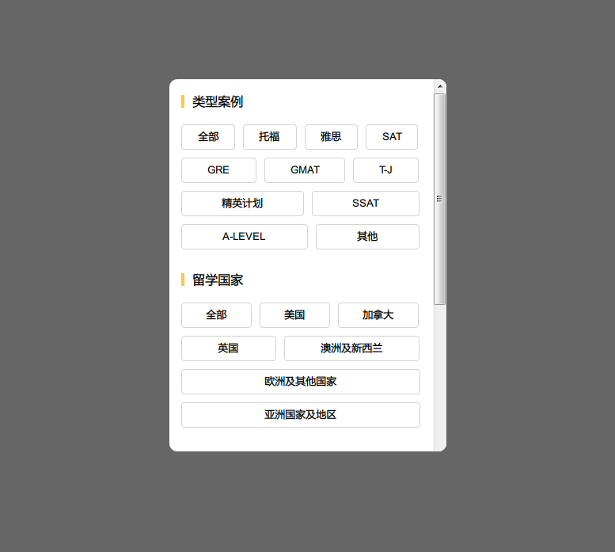
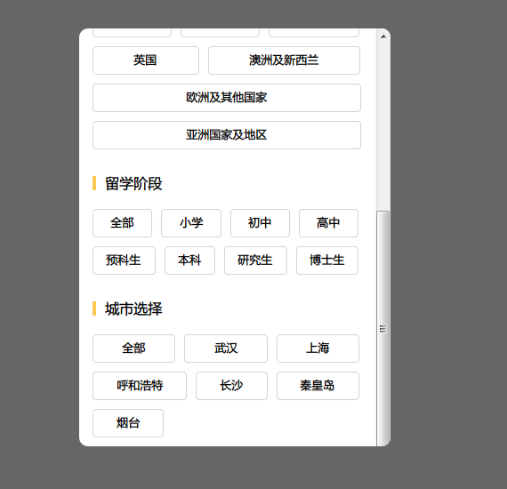

# TagsAlign

打造一款可以实现宽度自适应，但是两端能对齐的tab标签集合:poultry_leg:

### 函数功能

- [√] 计算多个标签的位置
- [√] 标签根据文字自适应宽度
- [√] 每行超过的宽度平均分配给每个标签
- [√] 每行标签左右对齐
- [√] 每行个数自适应或者固定

### 使用方法

直接调用函数`tagsAlign()`,支持三个参数：

- [ element ]  ul对应的id，**必传**
- [ cols ]       每行最多展示的个数，  **选传，不传为自适应**
- [ space ]      每两个li之间的间距，  **选传，不传时默认为10px**

### 效果展示
每行个数自适应，例如`tagsAlign('fromList')`

固定每行最多展示个数，例如`tagsAlign('studyList', 4); tagsAlign('caseList', 3)`

### 温馨提示
如果是用前端MV*框架，请在DOM元素已经渲染之后执行该函数。
函数源码已放出，需要的话可以根据自身需求定制